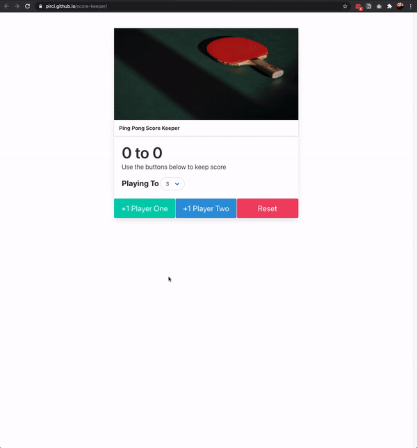

# Score Keeper Web App

> Score keeper app created using javascript. The target score can be changed. Player who reaching the target score is marked by green, the remainder by red. New game can be started with the reset button.

## Live Demo

Preview:  https://pirci.github.io/score-keeper/

## What I Learned:

- Using DOM Manipulation (document.querySelector)
- Applied and understanding JavaScript's "Boolean" object
- const and let variables declared used
- If statement implemented

## Possible Improvements

- More code reviews can be added for teamwork
- Could make the page layout more pleasing to the eye
- Formatting could be improved when viewing on certain devices/browsers

 > Any type of suggestions/improvements to this repo are always welcome.
